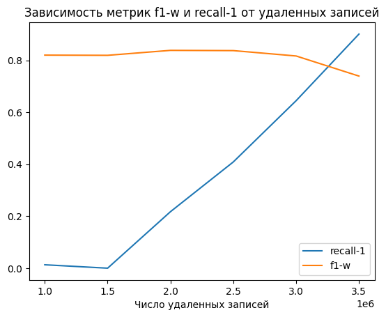

# Binary-Classification

# Auto Insurance Conversion Prediction  
**Команда ИТМО | Kaggle Playground Series 2024**  

## О проекте  
**Задача:** Предсказать, какие клиенты положительно отреагируют на предложение автострахования.  
**Метрика:**  F1 weighted, Recall (Response = "1").  

**Решение:** Docker-контейнер с **Streamlit-интерфейсом** и ML-моделью (LightGBM + Feature Engineering).  

**Участники:**  
- [Яна Муллина](https://github.com/yanamull) – API module
- [Дмитрий Кимельфельд](https://github.com/ku9efeld) – Model Training  and Data Preprocessing  
- [Елизавета Крылова](https://github.com/ElizavetaWow) – Docker/Deployment  
- [Владислав Маринин](https://github.com/Vladislav-maker) – EDA/Visualization/Unit tests for API

## 📊 EDA: Ключевые выводы  
**Проблема:** Дисбаланс классов (85 % Negative / 15 % Positive).  

  

*График зависимости качества обучения от размера удаленных строк из обучающей выборки.*  

**Действия:**  
- Удалено **3.25 млн. записей**
- Категориальные признаки для One-Hot Encoding

| Признак               | Тип данных          | Уникальные значения               | Пример значений                  |
|-----------------------|---------------------|-----------------------------------|----------------------------------|
| `Vehicle_Age`         | Порядковый          | 3                                 | `"< 1 Year"`, `"1-2 Year"`, `"> 2 Years"` |
| `Vehicle_Damage`      | Бинарный           | 2                                 | `"Yes"`, `"No"`                  |
| `Gender`              | Номинальный        | 2                                 | `"Male"`, `"Female"`             |
| `Driving_License`     | Бинарный (числовой) | 2                                 | `0`, `1`                        |    

## 📈 Результаты обучения

### Classification Report (Logistic Regression - Baseline) 
Минимальная предобработка данных, до удаления записей согласно выводам из EDA
| Metric      | Class 0 (Negative) | Class 1 (Positive) |  
|-------------|-------------------|-------------------|  
| Precision   | 0.88              | 0.00              |  
| Recall      | 1.00              | 0.00              |  
| F1-Score    | 0.93              | 0.00              |  
| Support     |    5,6 M          |    793   K        |

F1-Score w: 0.82

### Classification Report (LightGBM - The best model)  

| Metric      | Class 0 (Negative) | Class 1 (Positive) |
|-------------|-------------------|-------------------|  
| Precision   | 0.98              | 0.3              |  
| Recall      | 0.71              | 0.88              |  
| F1-Score    |    0.82           | 0.45              |  
| Support     |    5,6 M          |    793   K        |  

F1-Score w: 0.89

**Итоговый F1-Score weighted:** **0.89** 

